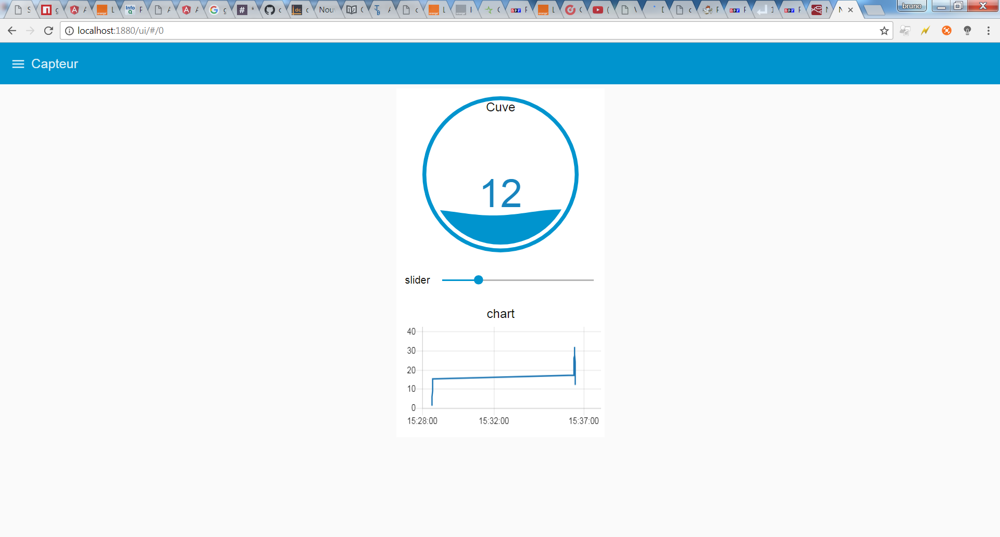
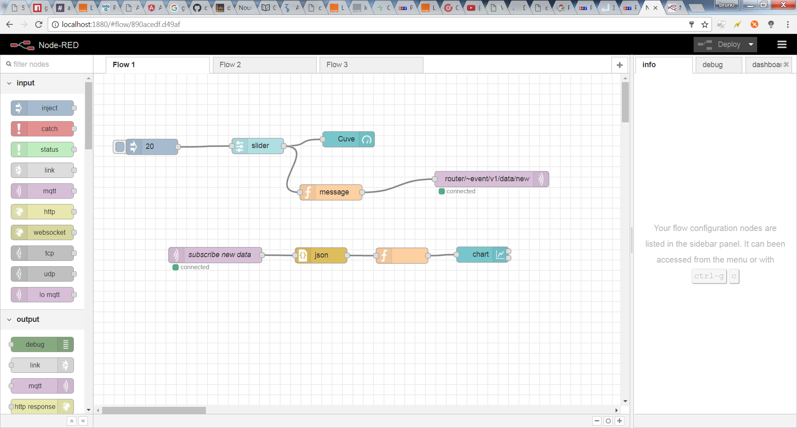

# node-red-contrib-liveobjects
Live Objects ((http://liveobjects.orange-business.com)) contrib to node red.

and the code :

Forks of mqtt and http-request to use corporate proxy if env.https_proxy exist.

<h2>install from scratch</h2>
clone node-red
* git clone https://github.com/node-red/node-red.git

* npm install

* npm run build

install node-red dashboard
* npm install node-red-dashboard --save

install node red contrib Live Objects
* npm install https://github.com/brusand/node-red-contrib-liveobjects.git --save

run node-red
* node red

<h2>composants</h2>
* lo-auth

authentification sans cookie. set credential with  LiveObjects  login/password 

* in/lo-mqtt

subscribe mqtt

* output/lo-mqtt

connection/publish

<h2>Samples<h2>
copy to clipboard and in node-red editor, import from clipboard, paste.

* auth

[{"id":"98748e09.acfe6","type":"debug","z":"8313f1c5.21917","name":"auth-response","active":true,"console":"true","complete":"payload","x":646.5000839233398,"y":77.20001602172852,"wires":[]},{"id":"4a3710c4.58188","type":"inject","z":"8313f1c5.21917","name":"aut","topic":"","payload":"{}","payloadType":"json","repeat":"","crontab":"","once":false,"x":85.20003890991211,"y":76.20001125335693,"wires":[["aae79854.0b9988"]]},{"id":"aae79854.0b9988","type":"lo-auth","z":"8313f1c5.21917","name":"","method":"POST","ret":"obj","url":"https://liveobjects.orange-business.comapi/v0/auth?cookie=false","proxy":"_ADD_","x":305.4091148376465,"y":78.45456314086914,"wires":[["98748e09.acfe6"]]}]

* mqtt

[{"id":"6c8ff7e.87cee08","type":"tab","label":"MQTT Pub SUB"},{"id":"f68758f3.513ca8","type":"lo-mqtt out","z":"6c8ff7e.87cee08","name":"pusub publish","topic":"pubsub/hello","qos":"","retain":"","broker":"b4fb4b8d.a3dc98","x":591.409309387207,"y":65.6363697052002,"wires":[]},{"id":"c4528cc9.3e826","type":"inject","z":"6c8ff7e.87cee08","name":"publish hello","topic":"","payload":"hello","payloadType":"str","repeat":"","crontab":"","once":false,"x":256.40909576416016,"y":65.90912437438965,"wires":[["f68758f3.513ca8"]]},{"id":"c5409664.48b9b8","type":"debug","z":"6c8ff7e.87cee08","name":"subscribed","active":true,"console":"true","complete":"true","x":598.4091720581055,"y":197.54546737670898,"wires":[]},{"id":"7f0de98a.f03a98","type":"lo-mqtt in","z":"6c8ff7e.87cee08","name":"","topic":"pubsub/hello","qos":"2","broker":"b4fb4b8d.a3dc98","x":259.5000991821289,"y":199.00003242492676,"wires":[["c5409664.48b9b8"]]},{"id":"7e8d760b.717848","type":"lo-mqtt in","z":"6c8ff7e.87cee08","name":"","topic":"pubsub/hello","qos":"2","broker":"b4fb4b8d.a3dc98","x":260.50001525878906,"y":322.00001525878906,"wires":[["e70f6d48.37a52"]]},{"id":"e70f6d48.37a52","type":"debug","z":"6c8ff7e.87cee08","name":"re subscribe hello","active":true,"console":"true","complete":"true","x":615.5000305175781,"y":325.19999504089355,"wires":[]},{"id":"b4fb4b8d.a3dc98","type":"lo-mqtt-broker","z":"","broker":"liveobjects.orange-business.com","port":"8080","clientid":"urn:lo:nsid:nodered:gauge01","usetls":false,"compatmode":false,"keepalive":"60","cleansession":true,"willTopic":"","willQos":"0","willPayload":"","birthTopic":"","birthQos":"0","birthPayload":""}]

* capteur mqtt + dashboard

[{"id":"25fe8769.4bb188","type":"tab","label":"MQTT Device"},{"id":"8f3381fb.783d4","type":"ui_gauge","z":"25fe8769.4bb188","name":"","group":"a363c188.3bca3","order":0,"width":0,"height":0,"gtype":"gage","title":"Gauge","label":"units","format":"{{value}}","min":0,"max":10,"colors":["#00b500","#e6e600","#ca3838"],"x":620.2000350952148,"y":74.38749027252197,"wires":[]},{"id":"439e881f.2bd798","type":"inject","z":"25fe8769.4bb188","name":"temp","topic":"","payload":"0","payloadType":"num","repeat":"","crontab":"","once":false,"x":85.20005798339844,"y":147.00000953674316,"wires":[["6b9f4391.24d2ac","e449eec0.fccce"]]},{"id":"6b9f4391.24d2ac","type":"ui_slider","z":"25fe8769.4bb188","name":"","label":"slider","group":"a363c188.3bca3","order":0,"width":0,"height":0,"passthru":true,"topic":"","min":0,"max":10,"step":1,"x":255.20004272460938,"y":75.00000762939453,"wires":[["8f3381fb.783d4","4ec81274.8b57dc"]]},{"id":"4ec81274.8b57dc","type":"function","z":"25fe8769.4bb188","name":"toLO","func":"lomsg = \n{\n    payload: {\n       \"streamId\":  \"urn:lo:nsid:nodered:gauge01\",\n       \"timestamp\": new Date(),\n       \"model\":  \"gauge\",\n       \"value\": {\n              temp: msg.payload\n       },\n       \"tags\" : [\"nodered\", \"test\"],\n       \"metadata\": {\n           \"source\": \"urn:lo:nsid:nodered:gauge01\"\n       }\n    }\n}\n\nreturn lomsg;","outputs":1,"noerr":0,"x":418.2000732421875,"y":151.9999828338623,"wires":[["f1d15b1a.e99688","6fe5aa90.2f7954"]]},{"id":"f1d15b1a.e99688","type":"debug","z":"25fe8769.4bb188","name":"","active":false,"console":"false","complete":"payload","x":657.2000846862793,"y":167.19998931884766,"wires":[]},{"id":"6fe5aa90.2f7954","type":"lo-mqtt out","z":"25fe8769.4bb188","name":"","topic":"router/~event/v1/data/new","qos":"","retain":"","broker":"b4fb4b8d.a3dc98","x":689.4091491699219,"y":255.7272720336914,"wires":[]},{"id":"5a140ba.4f952f4","type":"debug","z":"25fe8769.4bb188","name":"lo-auth","active":true,"console":"false","complete":"true","x":488.4090805053711,"y":301.5454521179199,"wires":[]},{"id":"241f2de.7e35dd2","type":"lo-mqtt in","z":"25fe8769.4bb188","name":"subscribe ~event/v1/data/new/#","topic":"router/~event/v1/data/new/#","qos":"2","broker":"b4fb4b8d.a3dc98","x":364.50001525878906,"y":375.8000030517578,"wires":[["d4f792d7.bb9e3"]]},{"id":"d4f792d7.bb9e3","type":"debug","z":"25fe8769.4bb188","name":"subscribed data","active":true,"console":"false","complete":"payload","x":672.4999847412109,"y":377.00001525878906,"wires":[]},{"id":"e449eec0.fccce","type":"lo-auth","z":"25fe8769.4bb188","name":"","method":"POST","ret":"obj","url":"https://liveobjects.orange-business.com/api/v0/auth?cookie=false","proxy":"_ADD_","x":250.40911483764648,"y":215.45457649230957,"wires":[["6fe5aa90.2f7954","5a140ba.4f952f4"]]},{"id":"a363c188.3bca3","type":"ui_group","z":"","name":"Eléments d'entrée","tab":"45e489e2.81a6a8","order":1,"disp":true,"width":"8"},{"id":"b4fb4b8d.a3dc98","type":"lo-mqtt-broker","z":"","broker":"liveobjects.orange-business.com","port":"8080","clientid":"urn:lo:nsid:nodered:gauge01","usetls":false,"compatmode":false,"keepalive":"60","cleansession":true,"willTopic":"","willQos":"0","willPayload":"","birthTopic":"","birthQos":"0","birthPayload":""},{"id":"45e489e2.81a6a8","type":"ui_tab","z":"","name":"Ecran Principal","icon":"home","order":1}]

